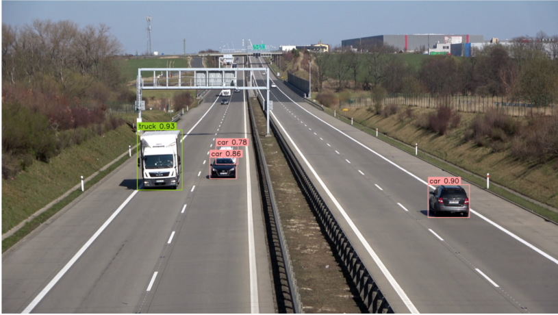
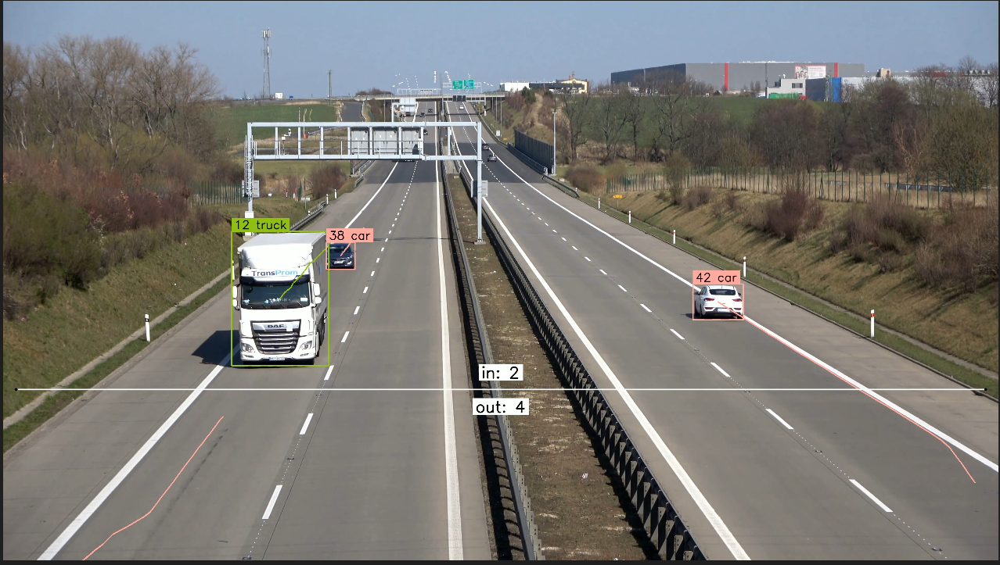
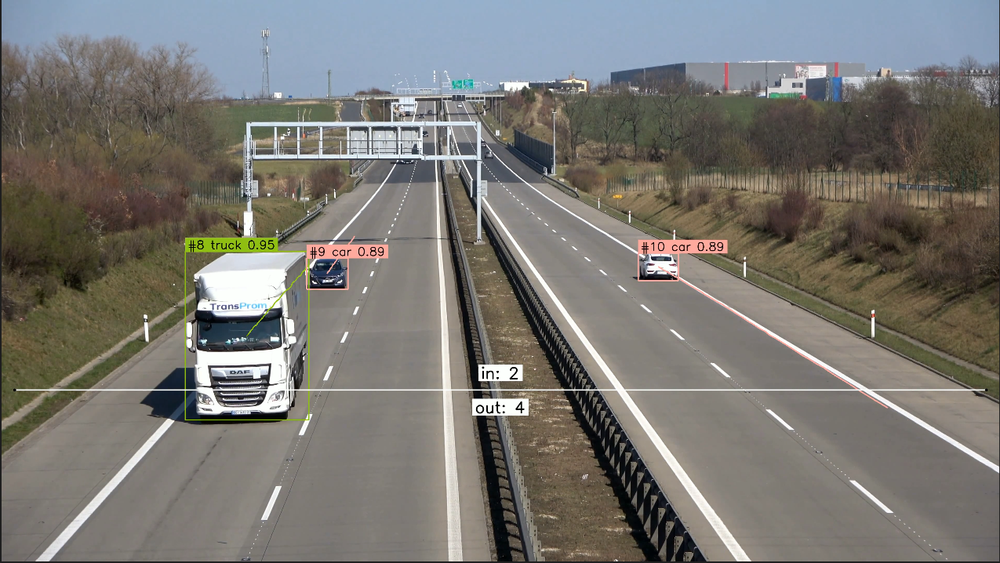

# Introduction 

This project focuses on object counting and multi-object tracking in real time using YOLOv10 for high-performance object detection, combined with ByteTrack and DeepSORT for robust and accurate object tracking across video frames

# Libraries
- Ultralytics
- Supervision
- Deep SORT realtime

# Tracking and Counting

I build a video-based vehicle counting and tracking system, applying modern technologies in computer vision to solve the problem of automatic vehicle recognition, tracking and counting. Specifically, the system will combine three main components: YOLOv8, ByteTrack, and DeepSORT.

# Implementation process

1. Object detection: Apply YOLOv10 to identify and label vehicles in each frame of the video. Objects are filtered according to the classes of interest: car, motorcycle, bus and truck.

2. Tracking with ByteTrack: Use ByteTrack to link objects across frames based on location and reliability information, thereby updating and maintaining the location of each vehicle over time.

3. Tracking with Deep SORT: Apply Deep SORT to improve tracking, ensuring the identity of each vehicle is maintained even when there is a phenomenon of intersection or temporary loss of track.

4. Counting vehicles and displaying results: Results are annotated directly on the video through bounding boxes, labels containing vehicle name information and vehicle number (ID) of each object. The system also marks a specific area (line zone) to count the number of vehicles passing through.

# Results 

**With DeepSort**

[📽️Click to watch video demo](https://drive.google.com/file/d/1vhYfxHrvvKtngpFjSbXlKm2SieDoOnK3/view?usp=sharing)

**With ByteTrack**

[📽️Click to watch video demo](https://drive.google.com/file/d/19J2zeH97X3MGla1h-7YFs3Dv6Cyf7QE2/view?usp=sharing)
